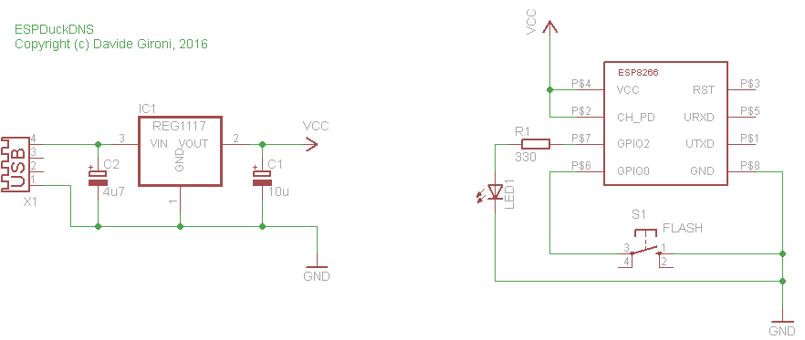

# ESPDuckDNS: ESP8266 Duck DNS Client

ESPDuckDNS is an **open source Duck DNS client based on ESP8266**.  
This fork updates the project structure for [PlatformIO](https://platformio.org/) and fixes deprecated code for modern ESP8266 development.

## Features

- Automatic Duck DNS updates from your ESP8266 device
- Simple web interface for configuration
- Status indication via onboard LEDs
- EEPROM storage for persistent settings

## Hardware

A schematic for connecting your ESP8266 and status LEDs is available at:  


See [schematics/espduckdns_sch-v1.png](schematics/espduckdns_sch-v1.png) for details.

## Getting Started (PlatformIO)

1. **Install PlatformIO**  
   - [PlatformIO IDE](https://platformio.org/install/ide?install=vscode) for VS Code is recommended.

2. **Clone this repository**  
   ```
   git clone https://github.com/yourusername/espduckdns.git
   cd espduckdns
   ```

3. **Open the project in VS Code**  
   - Use the PlatformIO sidebar to open the folder.

4. **Build and Upload**  
   - Connect your ESP8266 device.
   - Click "Upload" in PlatformIO, or run:
     ```
     pio run --target upload
     ```

5. **Monitor Serial Output**  
   - Enable Serial Debug in `main.cpp`
     ```
     #define DEBUGMODE DEBUGMODE_SERIAL
     ```
   - Use PlatformIO's "Monitor" button, or:
     ```
     pio device monitor
     ```

## Web Interface

Once flashed and connected to WiFi, access the device’s web interface to configure your Duck DNS domain and token.

## License

Copyright (c) Davide Gironi, 2016  
This is open source software licensed under the [GPLv3 license](http://opensource.org/licenses/GPL-3.0).

---

*This fork maintained by mdisterhof. Original project by Davide Gironi.*
